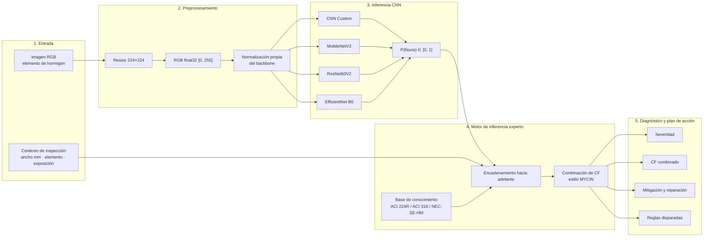

# CrackExpert AI


**Sistema híbrido de visión por computador y sistema experto para la detección visual y la evaluación patológica de fisuras en elementos de hormigón armado.**

Pontificia Universidad Católica del Ecuador — Sede Manabí · Asignatura de Sistemas Expertos.

---

## 1. Descripción general

Las fisuras en hormigón armado son un indicador temprano de pérdida de **servicio**, **durabilidad** y, en casos extremos, de **integridad estructural**. Un ancho excesivo facilita el ingreso de humedad, CO₂ y cloruros hacia la armadura; acelera la corrosión; y puede evidenciar mecanismos de fallo (flexión, cortante, asentamiento) que no deben interpretarse solo como un “defecto estético”.

La inspección visual humana es costosa, subjetiva y difícil de estandarizar. Un clasificador de aprendizaje profundo resuelve bien la **percepción** (¿hay fisura en la imagen?), pero no razona sobre **normativa**, exposición ambiental ni tipo de elemento. Inversamente, un sistema experto clásico razona con reglas ACI/NEC, pero no “ve” la fisura.

**CrackExpert AI** desacopla ambos problemas:

| Capa | Responsabilidad | Justificación |
| --- | --- | --- |
| Percepción (CNN) | Detectar presencia de fisura y emitir \(P(\text{fisura} \mid \text{imagen})\) | El patrón visual es un problema de visión; se valida con un test retenido de 600 imágenes. |
| Razonamiento (sistema experto) | Interpretar ancho, elemento y ambiente según ACI 224R-01, ACI 318 y NEC-SE-HM | Los límites de servicio y las acciones de reparación son conocimiento normativo, no datos de ImageNet. |
| Certeza (CF estilo MYCIN) | Combinar evidencia incierta (ML + medición + contexto) | La inspección de campo es incompleta; el dictamen debe ser trazable y no binario. |

El modelo de visión **no sustituye** un peritaje estructural. El sistema experto **no inventa** anchos ni cargas: emite un dictamen de severidad, un factor de certeza combinado y un plan de acción, con las reglas disparadas a la vista del ingeniero.

La memoria canónica del proyecto (propósito, rúbrica, estado y cómo retomar un chat) está en [`docs/PROJECT_CONTEXT.md`](docs/PROJECT_CONTEXT.md). La especificación formal de la base de conocimiento está en [`docs/EXPERT_SYSTEM_SPEC.md`](docs/EXPERT_SYSTEM_SPEC.md).

---

## 2. Arquitectura del sistema

El flujo es **desacoplado**: la CNN no contiene reglas normativas y el motor experto no entrena pesos. La interfaz (Streamlit) solo orquesta entradas y presenta el diagnóstico.



Flujo textual equivalente:

```text
[Imagen] --> [224×224 RGB] --> [CNN seleccionada] --> P(fisura)
                                                      |
[Ancho mm] [Tipo de elemento] [Ambiente] -------------+
                                                      v
                         [Motor experto + CF MYCIN]
                                                      v
              [Severidad | CF combinado | Plan de acción]
```

---

## 3. Estructura del repositorio

```text
crackexpert-ai/
├── data/
│   ├── raw/                      # Puntero/cache del dataset Kaggle (no versionado)
│   └── processed/                # Subconjunto 4.000 imgs: train / val / test
├── models/                       # Pesos .keras de las cuatro arquitecturas
├── reports/
│   ├── figures/                  # Curvas, matrices, ROC, errores
│   ├── models_comparison.csv     # Métricas cuantitativas del benchmark
│   ├── experiments_log.md        # Bitácora de corridas
│   └── TRAINING_RESULTS.md       # Informe acumulativo de entrenamientos
├── src/
│   ├── __init__.py
│   ├── data_loader.py            # kagglehub, muestreo 4k, splits, tf.data
│   ├── models.py                 # Fábrica de las 4 arquitecturas
│   ├── train.py                  # Dos fases, EarlyStopping, checkpoints
│   ├── evaluate.py               # Figuras, CSV y bitácora
│   └── expert_system.py          # Motor de reglas patológicas + CF
├── docs/
│   └── EXPERT_SYSTEM_SPEC.md     # Especificación formal del sistema experto
├── main.py                       # Orquestador: datos → train → evaluate
├── app.py                        # Interfaz interactiva Streamlit
├── requirements.txt
└── README.md
```

| Módulo | Rol |
| --- | --- |
| `src/data_loader.py` | Descarga `arunrk7/surface-crack-detection`, submuestrea 2.000+2.000, parte con `random_state=42` y construye `tf.data` (augmentation solo en train). |
| `src/models.py` | Define CNN Custom, MobileNetV2, ResNet50V2 y EfficientNet-B0; preprocesado ImageNet serializable. |
| `src/train.py` | Fase 1 (LR \(10^{-3}\), backbone congelado) y Fase 2 (LR \(10^{-5}\), fine-tuning); EarlyStopping `patience=5`. |
| `src/evaluate.py` | Test independiente \(n=600\): accuracy, precision, recall, F1, ROC-AUC, latencia y figuras. |
| `src/expert_system.py` | Encadenamiento hacia adelante sobre ACI/NEC y combinación de factores de certeza. |
| `main.py` | Reproduce el experimento completo en un solo comando. |
| `app.py` | Captura imagen + variables de dominio y muestra diagnóstico y plan de acción. |

---

## 4. Metodología y dataset

**Fuente.** [Surface Crack Detection](https://www.kaggle.com/datasets/arunrk7/surface-crack-detection) (`arunrk7/surface-crack-detection`): imágenes de superficies de hormigón etiquetadas `Positive` (fisura) y `Negative` (sin fisura).

**Subconjunto experimental.** Se extraen **exactamente 4.000** imágenes para controlar cómputo, equilibrio de clases y sobreajuste:

| Clase | Imágenes |
| --- | ---: |
| Positive (fisura) | 2.000 |
| Negative (sana) | 2.000 |
| **Total** | **4.000** |

**Partición estratificada** (`sklearn.model_selection.train_test_split`, `random_state=42`):

| Split | Proporción | Imágenes | Positive | Negative | Uso |
| --- | ---: | ---: | ---: | ---: | --- |
| Train | 70 % | 2.800 | 1.400 | 1.400 | Ajuste de pesos |
| Validation | 15 % | 600 | 300 | 300 | EarlyStopping y selección intra-entrenamiento |
| Test | 15 % | 600 | 300 | 300 | Evaluación **independiente y retenida** |

**Política anti *data leakage***

- El test **no** se usa para early stopping, fine-tuning ni selección de umbral.
- **Data augmentation exclusiva de train:** `RandomFlip`, `RandomRotation(0.1)`, `RandomZoom(0.1)`, `RandomBrightness(0.1)`.
- Validación y test solo se redimensionan a **224×224 RGB** (rango \([0, 255]\)). No hay flip, rotación ni zoom en esos splits.
- El muestreo y los índices de partición son deterministas (semilla 42), de modo que las corridas son reproducibles.

**Entrenamiento común.** Optimizador Adam, pérdida `binary_crossentropy`, `EarlyStopping(monitor='val_loss', patience=5, restore_best_weights=True)`. Transfer learning en dos fases (excepto la CNN Custom, que se refina a LR bajo en fase 2 sobre toda la red).

---

## 5. Benchmark de modelos evaluados

Se comparan **cuatro** arquitecturas sobre el mismo split y el mismo protocolo:

| ID | Arquitectura | Estrategia | Fine-tuning (fase 2) |
| --- | --- | --- | --- |
| 1 | CNN personalizada | Entrenamiento desde cero (3 bloques Conv2D + BatchNorm + MaxPool + Dropout + Dense) | Red completa, LR \(10^{-5}\) |
| 2 | MobileNetV2 | Transfer learning ImageNet | Últimas **25** capas, LR \(10^{-5}\) |
| 3 | ResNet50V2 | Transfer learning ImageNet | Últimas **20** capas, LR \(10^{-5}\) |
| 4 | EfficientNet-B0 | Transfer learning ImageNet | Últimas **20** capas, LR \(10^{-5}\) |

Fase 1 (todas las redes de transferencia): backbone congelado, LR \(10^{-3}\), se entrena la cabeza binaria (`sigmoid`).

**Criterio de selección del modelo óptimo** (implementado en `src/evaluate.py`):

1. Maximizar **F1-Score** en el test retenido (equilibrio precisión / exhaustividad).
2. Desempatar por **ROC-AUC**.
3. Desempatar por **menor latencia** (ms/imagen).

La tabla cuantitativa se escribe en `reports/models_comparison.csv` con las columnas:

`Modelo`, `Parametros_Totales`, `Tamano_MB`, `Latencia_ms`, `Val_Accuracy`, `Test_Accuracy`, `Precision`, `Recall`, `F1_Score`, `ROC_AUC`.

Las figuras de soporte (`reports/figures/`) incluyen curvas de aprendizaje por modelo, matrices de confusión en test, ROC superpuestas y ejemplos de falsos positivos / falsos negativos.

---

## 6. Guía de instalación y ejecución

Requisitos: Python 3.10+, cuenta de Kaggle configurada para `kagglehub` (token en `~/.kaggle/kaggle.json` o variables de entorno equivalentes).

### 6.1. Entorno virtual

**Windows (PowerShell)**

```powershell
cd CrackExpertAI
python -m venv .venv
.\.venv\Scripts\Activate.ps1
python -m pip install --upgrade pip
pip install -r requirements.txt
```

**Linux / macOS**

```bash
cd CrackExpertAI
python3 -m venv .venv
source .venv/bin/activate
python -m pip install --upgrade pip
pip install -r requirements.txt
```

### 6.2. Reproducir el pipeline experimental

Un solo comando descarga el dataset (si no está en caché), materializa el subconjunto 4.000, entrena las cuatro redes y genera métricas y figuras:

```bash
python main.py
```

Salidas esperadas:

- `models/<nombre>.keras`
- `reports/figures/learning_curves_<modelo>.png`
- `reports/figures/confusion_matrix_<modelo>.png`
- `reports/figures/roc_curves_comparison.png`
- `reports/figures/misclassified_examples.png`
- `reports/models_comparison.csv`
- `reports/experiments_log.md`

### 6.3. Interfaz interactiva

```bash
streamlit run app.py
```

La aplicación permite cargar una imagen, registrar ancho estimado, tipo de elemento y ambiente de exposición, y visualizar \(P(\text{fisura})\), severidad, CF combinado y el plan de mitigación.

---

## 7. Especificación resumida del sistema experto

Detalle normativo, reglas SI–ENTONCES y fórmulas MYCIN: [`docs/EXPERT_SYSTEM_SPEC.md`](docs/EXPERT_SYSTEM_SPEC.md).

### 7.1. Variables de entrada

| Variable | Dominio | Origen |
| --- | --- | --- |
| Probabilidad de fisura \(P\) | \([0, 1]\) | Salida `sigmoid` de la CNN |
| Ancho de fisura \(w\) | mm (SI), opcional | Medición de campo (fisurómetro) o estimación asistida |
| Tipo de elemento | Viga, Columna, Losa, Muro | Inspector |
| Ambiente de exposición | Interior seco; Exterior húmedo; Marino / agresivo | Inspector (mapeo a ACI 224R Tabla 4.1) |

### 7.2. Variables de salida

| Variable | Dominio |
| --- | --- |
| Nivel de severidad | Leve / estética · Moderada / durabilidad · Crítica / estructural |
| Factor de certeza combinado \(\mathrm{CF}_{\mathrm{comb}}\) | \([-1, 1]\) |
| Medidas de mitigación y reparación | Lista priorizada, trazable a reglas disparadas |

### 7.3. Factores de certeza (visión general)

Cada regla \(R_i\) posee un **CF base** \(\mathrm{CF}_i \in [-1, 1]\) que expresa la confianza del experto normativo en la conclusión **si** las premisas son ciertas. La evidencia incierta (p. ej. \(P\) del clasificador, calidad de la medición de \(w\)) atenúa ese CF. Varias reglas que concluyen la misma hipótesis se combinan con las fórmulas clásicas de MYCIN (véase la especificación).

**Límites de ancho de referencia (ACI 224R-01 Tabla 4.1), usados como umbrales de durabilidad:**

| Ambiente de exposición (interfaz) | Condición ACI 224R | \(w_{\max}\) (mm) |
| --- | --- | ---: |
| Interior seco | Aire seco o membrana protectora | 0,41 |
| Exterior húmedo | Humedad, aire húmedo, suelo | 0,30 |
| Marino / agresivo | Agua de mar / ciclo húmedo-seco | 0,15 |

Valores adicionales de la misma tabla (sales de deshielo 0,18 mm; depósitos 0,10 mm) se documentan en la especificación y pueden activarse como subcasos del ambiente agresivo.

---

## 8. Alcance y limitaciones

- El dataset público caracteriza **presencia/ausencia** de fisura superficial, no el mecanismo estructural ni el ancho real en milímetros.
- El dictamen experto es un **apoyo a la decisión** y no un certificado de estabilidad.
- La latencia y el tamaño de modelo se reportan para comparación académica; el despliegue en obra puede exigir cuantización u hardware específico.

## 9. Licencia y uso académico

Proyecto desarrollado con fines formativos en la asignatura de Sistemas Expertos, PUCE Sede Manabí. Las normas ACI y NEC se citan como **referencias técnicas**; su aplicación profesional requiere el texto oficial vigente y un ingeniero civil responsable.
