# Resultados de entrenamiento — CrackExpert AI

Documento **acumulativo**. Cada corrida se anexa como una sección nueva, sin borrar las anteriores. Las figuras de la corrida 01 quedaron en `reports/archive/2026-08-16_083631/figures/`. Las de la corrida 02 (8k) están en `reports/figures/` (vigentes) y hay otro snapshot 4k en `reports/archive/2026-08-16_215127/` (copia automática justo antes de `main.py` 8k).

| Corrida | Fecha | Protocolo | Modelo seleccionado (criterio F1 → AUC → latencia) |
| ---: | --- | --- | --- |
| 01 | 2026-08-16 02:06:32 | 4.000 imgs, test \(n=600\) | **CNN personalizada** |
| 02 | 2026-08-17 02:22:23 | 8.000 imgs, test \(n=1.200\) | **MobileNetV2** (Kaggle); en OOD sigue ganando la CNN |

---

## Corrida 01 — 16 de agosto de 2026

**Identificador:** `2026-08-16 02:06:32` (bitácora automática `experiments_log.md`)  
**Comando:** `python main.py`  
**Estado:** pipeline completo (datos → 4 modelos → evaluación en test retenido).

### 1. Protocolo experimental

| Ítem | Valor |
| --- | --- |
| Dataset | `arunrk7/surface-crack-detection` |
| Subconjunto | 4.000 imágenes (2.000 Positive / 2.000 Negative) |
| Partición | estratificada, `random_state=42` |
| Train / Val / Test | 2.800 / 600 / 600 (1.400+1.400 / 300+300 / 300+300) |
| Entrada | 224×224 RGB, rango \([0, 255]\) |
| Augmentation | solo train: Flip, Rotation(0.1), Zoom(0.1), Brightness(0.1) |
| Pérdida / optimizador | `binary_crossentropy` / Adam |
| Fase 1 | LR \(= 10^{-3}\), backbone congelado (CNN: red completa) |
| Fase 2 | LR \(= 10^{-5}\); MobileNetV2 25 capas; ResNet50V2 y EfficientNet-B0 20 capas |
| EarlyStopping | `monitor=val_loss`, `patience=5`, `restore_best_weights=True` |
| Épocas máximas | 20 + 20 |

### 2. Tabla cuantitativa (test independiente, \(n = 600\))

Fuente: `reports/models_comparison.csv`.

| Modelo | Parámetros | Tamaño (MB) | Latencia (ms/img) | Val Acc | Test Acc | Precision | Recall | F1 | ROC-AUC |
| --- | ---: | ---: | ---: | ---: | ---: | ---: | ---: | ---: | ---: |
| CNN personalizada | 110 561 | 1,343 | **6,444** | 0,9933 | **1,0000** | 1,0000 | 1,0000 | **1,0000** | 1,0000 |
| MobileNetV2 | 2 259 265 | 19,491 | 11,129 | 0,9967 | 0,9967 | 0,9934 | 1,0000 | 0,9967 | 1,0000 |
| ResNet50V2 | 23 566 849 | 150,610 | 22,302 | 0,9967 | 1,0000 | 1,0000 | 1,0000 | 1,0000 | 1,0000 |
| EfficientNet-B0 | 4 050 852 | 26,527 | 13,999 | 0,9967 | 1,0000 | 1,0000 | 1,0000 | 1,0000 | 1,0000 |

**Lectura breve**

- Tres modelos alcanzan **F1 = 1,0** y **AUC = 1,0** en test: CNN Custom, ResNet50V2 y EfficientNet-B0.
- **MobileNetV2** es el único con errores en test: accuracy 0,9967 \(\approx\) **2/600**. Precision 0,9934 y Recall 1,0 implican **falsos positivos** (superficie sana clasificada como fisura), no falsos negativos.
- El criterio automático (máximo F1, luego AUC, luego **menor latencia**) elige la **CNN personalizada**: mismo F1/AUC que ResNet y EfficientNet, con **~20× menos parámetros** que MobileNet y **~110× menos** que ResNet50V2, y la menor latencia (6,4 ms/imagen).

### 3. Dinámica de entrenamiento (historiales)

Los JSON están en `reports/history_<modelo>.json`. La línea vertical de las figuras marca el paso a la fase 2 (época 20 cuando ambas fases corren completas).

| Modelo | Épocas registradas | EarlyStopping | Mejor `val_loss` (aprox.) | Comentario |
| --- | ---: | --- | ---: | --- |
| CNN personalizada | 40 (20+20) | No cortó | 0,0244 (época ~39) | Val inestable al inicio (acc 0,50 durante 4 épocas); se recupera y cierra en val acc 0,993 |
| MobileNetV2 | 27 (20 + 7) | Sí, en fase 2 | 0,0185 (época ~22) | Convergencia inmediata en fase 1; fase 2 se detiene por paciencia |
| ResNet50V2 | 40 (20+20) | No cortó | 0,0089 (época ~39) | Descenso monótono de val_loss; red más pesada |
| EfficientNet-B0 | 40 (20+20) | No cortó | 0,0055 (época ~40) | Mejor val_loss de la corrida; val acc hasta 0,9983 |

#### CNN personalizada

Baseline desde cero. La pérdida de validación oscila fuerte en las primeras épocas (incluso \(>2\)), coherente con un clasificador que aún no separa clases. A partir de ~época 9 la val accuracy supera 0,98. La fase 2 (LR bajo) suaviza la curva y lleva val_loss al mínimo de la corrida para este modelo.

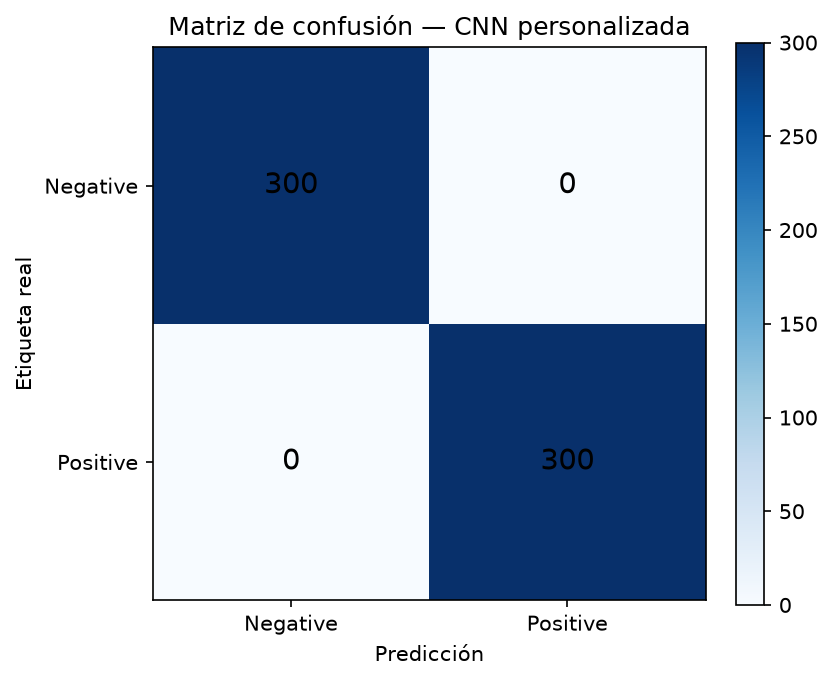

En el test retenido: **300 TN / 0 FP / 0 FN / 300 TP** (matriz diagonal perfecta).

#### MobileNetV2

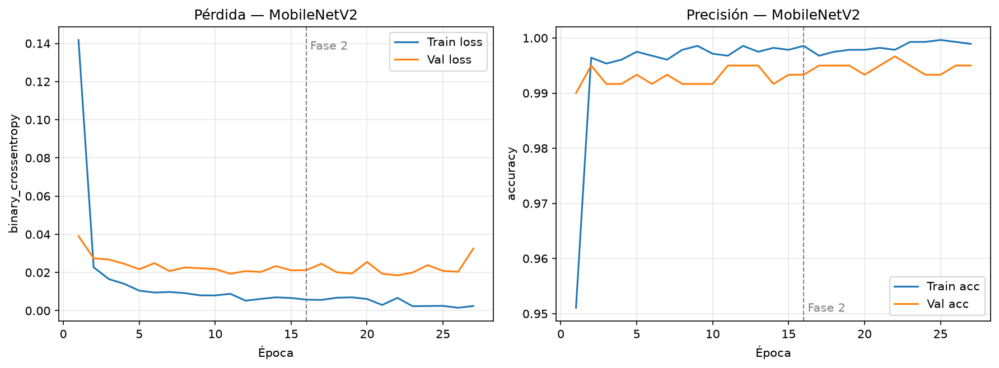

Transfer learning: ya en la época 1 la val accuracy está en 0,99. El fine-tuning de 25 capas aporta poco margen y dispara EarlyStopping (27 épocas totales).

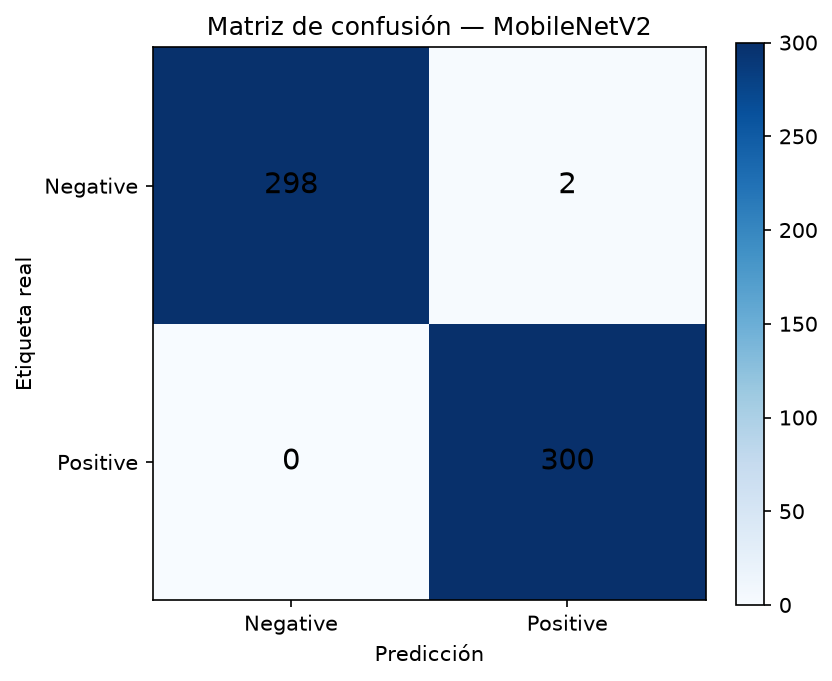

Test: Recall perfecto (300/300 fisuras) y **2 falsos positivos** (298 TN, 2 FP). Es el único modelo que no satura el test.

#### ResNet50V2

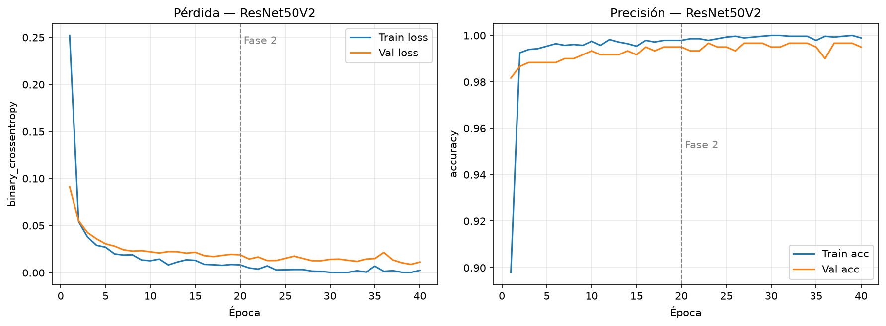

Fase 1 ya deja val_loss en ~0,017; la fase 2 lo reduce hasta ~0,009. Coste: **150 MB** y **22 ms/imagen**, el peor compromiso tamaño/latencia del benchmark.

Test: clasificación perfecta (300/300 por clase).

#### EfficientNet-B0

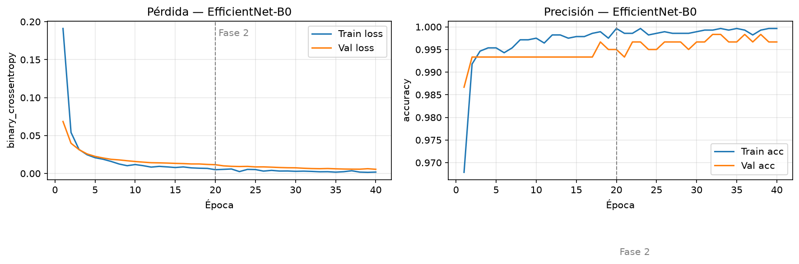

Val_loss más bajo y más estable de los cuatro. Val accuracy 0,9967 en la evaluación final reportada en el CSV (coincidente con el último evaluate sobre val). Test perfecto.

Test: 300/300 por clase.

### 4. Comparación ROC

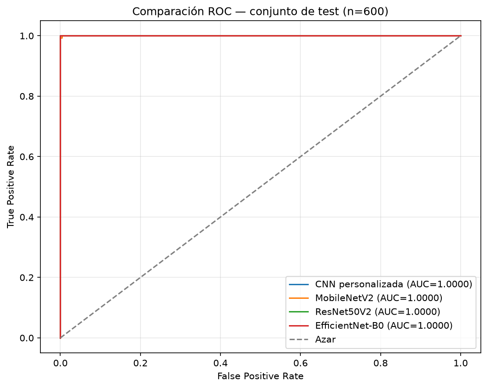

Las cuatro curvas se superponen en la esquina superior izquierda (**AUC = 1,0000** para todos). Eso indica discriminación casi perfecta de scores en el test: incluso MobileNetV2, con 2 errores al umbral 0,5, ordena bien las probabilidades (los 2 FP siguen siendo separables en ROC si sus scores no invierten el ranking global de forma apreciable a esta resolución).

### 5. Errores de clasificación (modelo seleccionado)

La cuadrícula se genera para el modelo de **mayor F1** (CNN personalizada). En esta corrida **no hay FP ni FN** en test, de modo que la figura solo documenta la ausencia de errores.

> Nota: los 2 FP de MobileNetV2 **no** aparecen aquí. Si en una corrida futura se quiere inspeccionar errores de *todos* los modelos, hay que ampliar `evaluate.py`.

### 6. Selección del modelo óptimo (corrida 01)

Se adopta **CNN personalizada** (`models/cnn_custom.keras`) porque:

1. Empata el mejor F1 (1,0) y el mejor AUC (1,0) en test.
2. Es el de **menor latencia** (6,44 ms) y **menor tamaño** (1,34 MB / 1,1×10⁵ parámetros).
3. El test no participó en EarlyStopping ni en el ajuste de LR.

ResNet50V2 y EfficientNet-B0 son equivalentes en métricas de test, pero injustificables para despliegue si la CNN custom ya satura el conjunto. MobileNetV2 queda como referencia de transferencia ligera, con un ligero exceso de falsos positivos.

### 7. Lectura crítica (importante para el informe académico)

El dataset de fisuras superficiales es **visualmente muy separable** (fisura oscura sobre fondo claro). Accuracy/F1 de 1,0 en 600 imágenes no implica que el problema de patología estructural esté “resuelto”:

- El test mide **presencia/ausencia** de fisura, no ancho en mm ni mecanismo (flexión vs cortante).
- Un F1 perfecto puede indicar **techo del dataset**, no superioridad absoluta de la CNN custom frente a ImageNet.
- La val accuracy de la CNN (0,9933) es **ligeramente inferior** al test (1,0): diferencia de 4 errores en val vs 0 en test; plausible por azar de 600 muestras, no por fuga de datos (el test no se aumentó ni se usó en callbacks).
- El sistema experto (ACI/NEC) **no** se evalúa en esta corrida: solo la capa de percepción.

### 8. Artefactos de la corrida

| Ruta | Contenido |
| --- | --- |
| `models/cnn_custom.keras` | Pesos del modelo seleccionado |
| `models/mobilenet_v2.keras` | Pesos MobileNetV2 |
| `models/resnet50_v2.keras` | Pesos ResNet50V2 |
| `models/efficientnet_b0.keras` | Pesos EfficientNet-B0 |
| `reports/models_comparison.csv` | Tabla de esta corrida |
| `reports/history_*.json` | Curvas por época |
| `reports/experiments_log.md` | Entrada automática `Corrida 2026-08-16 02:06:32` |

---

## Prueba externa 01 — 16 de agosto de 2026

**Comando:** `python test_external.py`  
**Fotos:** 9 archivos `.jpeg` en `data/external_test/` (el script acepta `.jpeg`, `.jpg`, `.png`, `.webp`, `.bmp`).  
**Tabla generada:** [`external_test_comparison.md`](external_test_comparison.md) · [`external_test_comparison.csv`](external_test_comparison.csv)

| Archivo | CNN personalizada | MobileNetV2 | ResNet50V2 | EfficientNet-B0 | Consenso |
| --- | --- | --- | --- | --- | --- |
| 1.jpeg | FISURA 100.0% (P=1.000) | FISURA 99.2% (P=0.992) | FISURA 100.0% (P=1.000) | FISURA 100.0% (P=1.000) | FISURA (4/4) |
| 2.jpeg | FISURA 93.1% (P=0.931) | FISURA 62.6% (P=0.626) | SANA 93.0% (P=0.070) | FISURA 99.9% (P=0.999) | DISCREPANCIA (3/4) |
| 3.jpeg | FISURA 99.8% (P=0.998) | FISURA 98.8% (P=0.988) | FISURA 58.6% (P=0.586) | FISURA 100.0% (P=1.000) | FISURA (4/4) |
| 4.jpeg | SANA 95.5% (P=0.045) | SANA 92.0% (P=0.080) | FISURA 61.2% (P=0.612) | FISURA 99.9% (P=0.999) | DISCREPANCIA (2/4) |
| 5.jpeg | FISURA 81.8% (P=0.818) | SANA 94.2% (P=0.058) | SANA 88.5% (P=0.115) | SANA 91.2% (P=0.088) | DISCREPANCIA (1/4) |
| 6.jpeg | SANA 97.7% (P=0.023) | SANA 98.7% (P=0.013) | SANA 99.9% (P=0.001) | SANA 97.9% (P=0.021) | SANA (4/4) |
| 7.jpeg | FISURA 94.7% (P=0.947) | FISURA 96.8% (P=0.968) | SANA 98.7% (P=0.013) | FISURA 76.7% (P=0.767) | DISCREPANCIA (3/4) |
| WhatsApp … 7.43.25 AM.jpeg | FISURA 87.7% (P=0.877) | FISURA 89.8% (P=0.898) | SANA 97.9% (P=0.021) | FISURA 92.8% (P=0.928) | DISCREPANCIA (3/4) |
| WhatsApp … 7.43.28 AM.jpeg | FISURA 93.6% (P=0.936) | SANA 65.3% (P=0.347) | SANA 96.9% (P=0.031) | SANA 97.5% (P=0.025) | DISCREPANCIA (1/4) |

**Lectura.** El test de Kaggle estaba saturado (F1≈1); en fotos reales hay **6/9 discrepancias**. ResNet50V2 tiende a negar fisura donde los demás coinciden (2, 7, WhatsApp 7.43.25). EfficientNet-B0 marca fisura en 4.jpeg con P≈1 mientras CNN y MobileNet la dan sana. La CNN custom es la más “positiva” (fisura en 7/9). El único consenso sano es **6.jpeg**. Esto sugiere que el modelo óptimo por latencia en el test interno **no** es automáticamente el más fiable en campo: conviene mirar el consenso y el sistema experto, no un solo backbone.

---

## Corrida 02 — 17 de agosto de 2026

**Identificador:** `2026-08-17 02:22:23` (bitácora `experiments_log.md`)  
**Comando:** `python main.py`  
**Estado:** pipeline completo (archivo 4k → 8.000 imgs → 4 modelos → test \(n=1.200\) → OOD).  
**Cambios respecto a la corrida 01:** mismo protocolo (semilla 42, 2 fases, EarlyStopping); **solo se duplica el subconjunto** (2.000→4.000 por clase). No hay quinta arquitectura ni otro LR.

### 1. Protocolo experimental

| Ítem | Valor |
| --- | --- |
| Dataset | `arunrk7/surface-crack-detection` |
| Subconjunto | 8.000 imágenes (4.000 Positive / 4.000 Negative) |
| Partición | estratificada, `random_state=42` |
| Train / Val / Test | 5.600 / 1.200 / 1.200 (2.800+2.800 / 600+600 / 600+600) |
| Entrada | 224×224 RGB, rango \([0, 255]\) |
| Augmentation | solo train: Flip, Rotation(0.1), Zoom(0.1), Brightness(0.1) |
| Pérdida / optimizador | `binary_crossentropy` / Adam |
| Fase 1 | LR \(= 10^{-3}\), backbone congelado (CNN: red completa) |
| Fase 2 | LR \(= 10^{-5}\); MobileNetV2 25 capas; ResNet50V2 y EfficientNet-B0 20 capas |
| EarlyStopping | `monitor=val_loss`, `patience=5`, `restore_best_weights=True` |
| Épocas máximas | 20 + 20 |

### 2. Tabla cuantitativa (test independiente, \(n = 1.200\))

Fuente: `reports/models_comparison.csv` (vigente). Snapshot 4k: `reports/archive/2026-08-16_083631/models_comparison.csv`.

| Modelo | Parámetros | Tamaño (MB) | Latencia (ms/img) | Val Acc | Test Acc | Precision | Recall | F1 | ROC-AUC |
| --- | ---: | ---: | ---: | ---: | ---: | ---: | ---: | ---: | ---: |
| CNN personalizada | 110 561 | 1,343 | **6,499** | 0,9983 | 0,9983 | **1,0000** | 0,9967 | 0,9983 | 1,0000 |
| MobileNetV2 | 2 259 265 | 19,491 | 11,310 | **1,0000** | **1,0000** | 1,0000 | **1,0000** | **1,0000** | 1,0000 |
| ResNet50V2 | 23 566 849 | 150,610 | 22,666 | 1,0000 | 0,9983 | 0,9967 | 1,0000 | 0,9983 | 1,0000 |
| EfficientNet-B0 | 4 050 852 | 26,527 | 14,071 | 0,9992 | 0,9992 | 0,9983 | 1,0000 | 0,9992 | 1,0000 |

**Lectura breve**

- El dominio Kaggle **sigue saturado**: todos tienen AUC = 1,0 y F1 ≥ 0,998. Duplicar el subconjunto **no** “rompe” el techo; confirma que el benchmark es visualmente separable.
- **MobileNetV2** es el único con **F1 = 1,0** en test (0 errores / 1.200). En la corrida 4k era el único *con* errores (2 FP); aquí se invierte.
- **CNN personalizada:** 2 errores, ambos **FN** (precision 1,0 y recall 0,9967 ⇒ 598/600 fisuras; 2 fisuras del test se fueron a sana). Acc = 1.198/1.200.
- **ResNet50V2:** 2 **FP** (recall 1,0 y precision 0,9967).
- **EfficientNet-B0:** 1 **FP** (F1 0,9992). El segundo mejor en Kaggle, no el primero.
- El criterio automático (máximo F1, luego AUC, luego latencia) elige **MobileNetV2**. Eso **no** coincide con el ranking OOD (abajo): en campo gana la CNN.

**Delta 4k → 8k (test Kaggle)**

| Modelo | F1 4k (\(n=600\)) | F1 8k (\(n=1.200\)) | Qué cambió |
| --- | ---: | ---: | --- |
| CNN personalizada | 1,0000 | 0,9983 | De 0 errores a 2 FN |
| MobileNetV2 | 0,9967 | 1,0000 | De 2 FP a 0 errores |
| ResNet50V2 | 1,0000 | 0,9983 | De 0 errores a 2 FP |
| EfficientNet-B0 | 1,0000 | 0,9992 | De 0 errores a 1 FP |

Con el doble de test, aparecen 1–2 fallos que el \(n=600\) no veía. Sigue siendo un techo de dataset, no un fracaso de entrenamiento.

### 3. Dinámica de entrenamiento (historiales)

JSON en `reports/history_<modelo>.json`. La fase 2 empieza en la época 21 si la fase 1 no cortó (aquí las cuatro llegaron a 20+).

| Modelo | Épocas | EarlyStopping | Mejor `val_loss` | Comentario |
| --- | ---: | --- | ---: | --- |
| CNN personalizada | 36 (20+16) | Sí, fase 2 | 0,0086 (época 36) | Val acc 0,50 en épocas 1–2 y otra vez en la 5; luego se estabiliza en 0,998 |
| MobileNetV2 | 33 (20+13) | Sí, fase 2 | 0,0002 (época 28) | Val acc ≥ 0,998 desde la época 1; el fine-tuning baja val_loss casi a cero |
| ResNet50V2 | 26 (20+6) | Sí, fase 2 | 0,0003 (época 21) | Fase 1 ya deja val acc 1,0; la fase 2 corta pronto |
| EfficientNet-B0 | 29 (20+9) | Sí, fase 2 | 0,0015 (época 24) | Convergencia inmediata; 1 FP en test |

#### CNN personalizada

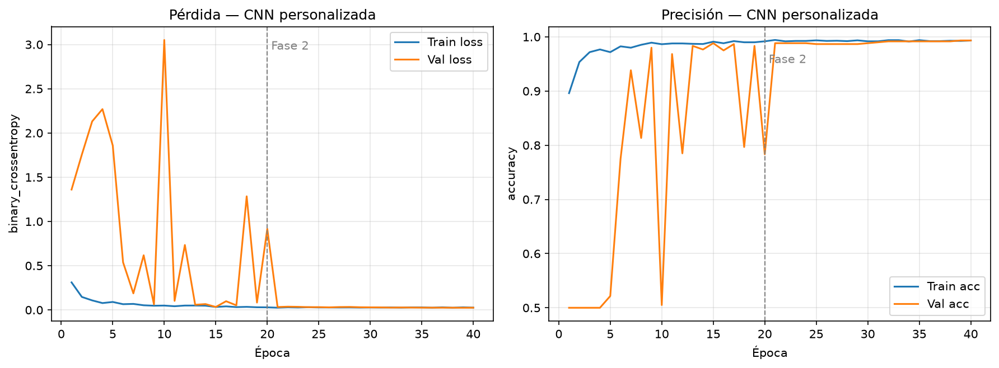

Sigue el patrón de la corrida 01: baseline desde cero, val_loss inicial \(>2\), recuperación en pocas épocas. Con 8k el mejor val_loss (0,0086) es **mejor** que en 4k (~0,024), pero el test ya no es perfecto: 2 fisuras se le escapan.

Test: **600 TN / 0 FP / 2 FN / 598 TP**.

#### MobileNetV2

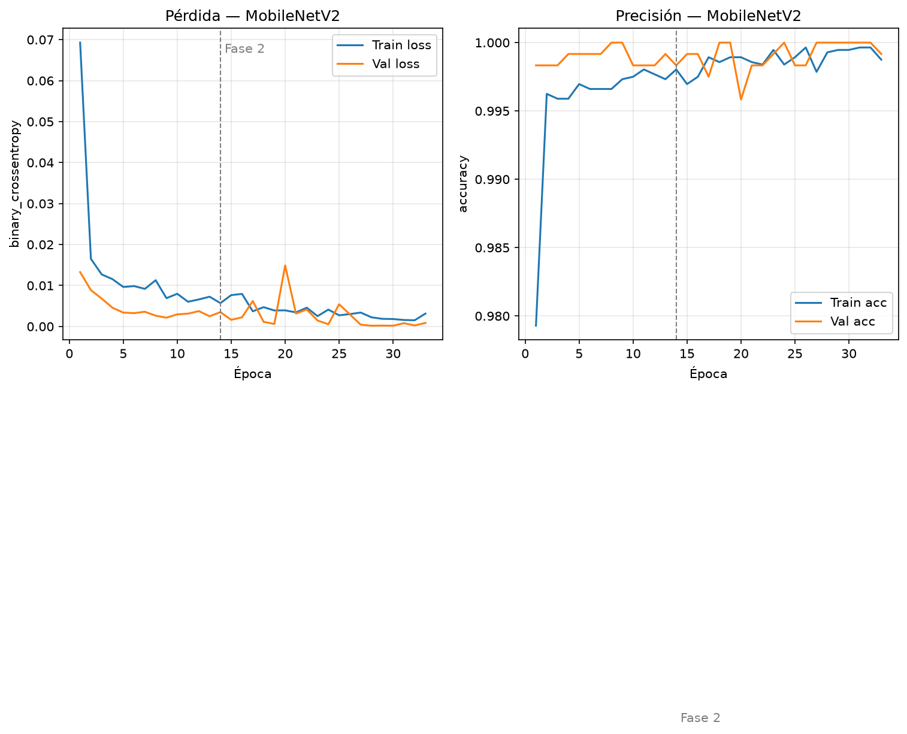

Transfer learning: val accuracy ~0,998 desde el primer paso. EarlyStopping en fase 2 (33 épocas). Es el modelo que el CSV marca como óptimo por F1 en Kaggle.

Test: **600 TN / 0 FP / 0 FN / 600 TP**.

#### ResNet50V2

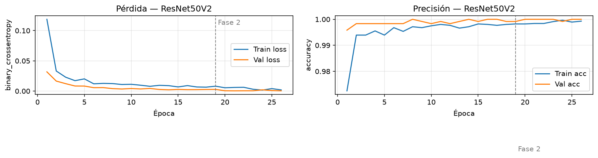

Val_loss ~0,0005 ya al final de la fase 1; la fase 2 apenas dura 6 épocas. Coste intacto: **150 MB** y **~23 ms/imagen**.

Test: **598 TN / 2 FP / 0 FN / 600 TP**.

#### EfficientNet-B0

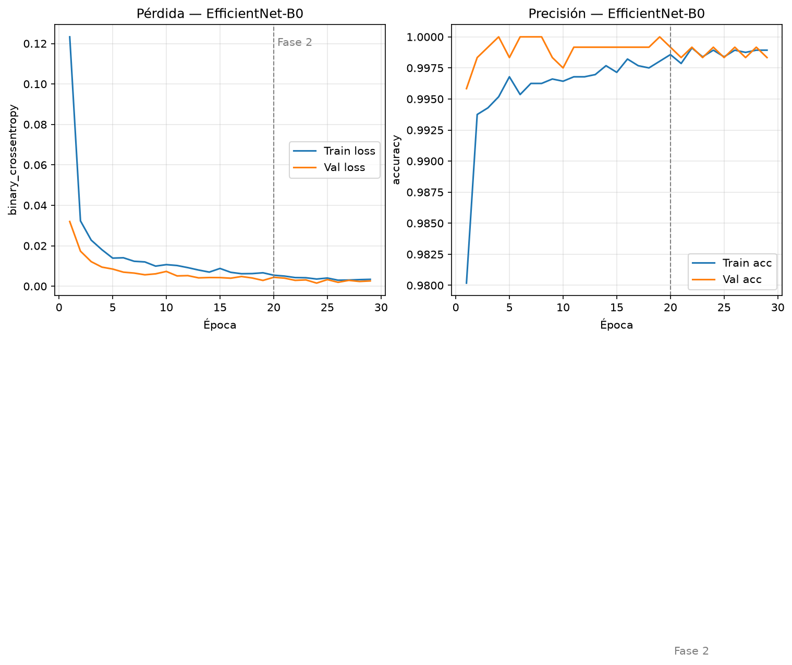

Val_loss mínimo 0,0015 (época 24). Un solo falso positivo en 1.200.

Test: **599 TN / 1 FP / 0 FN / 600 TP**.

### 4. Comparación ROC

Las cuatro curvas siguen pegadas a la esquina superior izquierda (**AUC = 1,0000**). Los 1–2 errores al umbral 0,5 no desordenan el ranking de scores en el test de Kaggle.

### 5. Errores de clasificación (modelo de mayor F1)

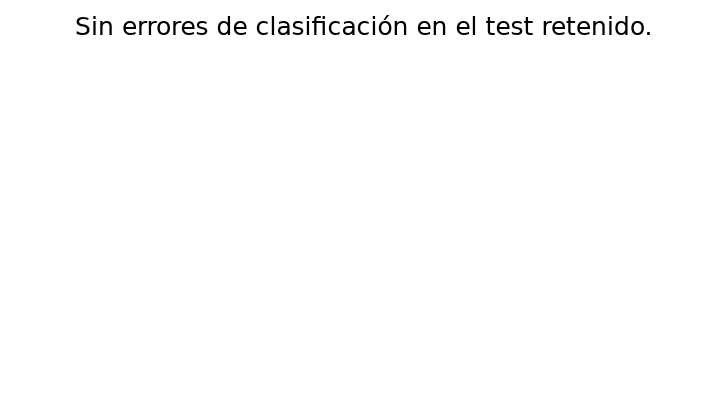

La cuadrícula se genera para el de **mayor F1** (MobileNetV2). En esta corrida **no hay FP ni FN** de ese modelo en test, así que la figura documenta la ausencia de errores. Los 2 FN de la CNN y los FP de ResNet/EfficientNet **no** aparecen aquí.

### 6. Selección del modelo óptimo (corrida 02)

Por el criterio automático del pipeline (F1 test Kaggle → AUC → latencia) se adopta **MobileNetV2** (`models/mobilenet_v2.keras`):

1. Único F1 = 1,0 en el test de 1.200.
2. AUC = 1,0 (empatado con los demás).
3. El test no participó en EarlyStopping.

**Para el informe y para campo eso no basta.** En OOD (abajo) MobileNetV2 queda **por debajo** de la CNN (F1 0,278 vs 0,467). La CNN sigue siendo la más barata (6,5 ms, 1,3 MB) y la que **más fisuras reales recupera** (recall OOD 0,70). Criterio de titulación: Kaggle + OOD + latencia, no solo el CSV de `evaluate.py`.

### 7. Lectura crítica

- Duplicar datos **no** resolvió el *domain shift*. F1 Kaggle ≥ 0,998 y F1 OOD ≤ 0,47 es el mismo cuento que en 4k, ahora con más test.
- Un F1 de 1,0 de MobileNet en Kaggle **no** implica que sea el modelo de despliegue.
- La CNN “empeora” 2 errores en Kaggle y **mejora** el F1 OOD (0,42 → 0,47); ojo: el OOD pasó de \(n=71\) (24 Pos) a \(n=77\) (30 Pos), así que el delta no es solo el entrenamiento.
- El sistema experto **no** se mide en esta tabla: solo percepción.

### 8. Artefactos de la corrida

| Ruta | Contenido |
| --- | --- |
| `models/*.keras` | Pesos 8k (sobrescriben los 4k) |
| `reports/models_comparison.csv` | Tabla 8k vigente |
| `reports/history_*.json` | Curvas 8k |
| `reports/figures/` | Figuras 8k |
| `reports/archive/2026-08-16_215127/` | Snapshot automático de la corrida previa |
| `reports/experiments_log.md` | Entrada `Corrida 2026-08-17 02:22:23` |

---

## Prueba externa 02 — 17 de agosto de 2026 (modelos 8k)

**Comando:** `python test_external.py` (lo lanza `main.py` al final)  
**Identificador:** `2026-08-17 02:22:55`  
**Fotos:** 77 etiquetadas (30 Positive / 47 Negative). La corrida OOD de los pesos 4k era \(n=71\) (24/47): hay **6 Positive nuevas**; no comparar F1 como si el conjunto fuera idéntico.  
**Tabla:** [`external_test_comparison.md`](external_test_comparison.md)

| Modelo | Accuracy | Precision | Recall | F1 |
| --- | ---: | ---: | ---: | ---: |
| CNN personalizada | 0,377 | 0,350 | **0,700** | **0,467** |
| MobileNetV2 | 0,325 | 0,238 | 0,333 | 0,278 |
| EfficientNet-B0 | 0,234 | 0,204 | 0,333 | 0,253 |
| ResNet50V2 | 0,234 | 0,061 | 0,067 | 0,063 |

**Lectura.** Accuracy OOD sigue engañosa (desbalance 30/47). En campo la **CNN custom sigue primera** (F1 0,467, recall 0,70). MobileNet, ganador de Kaggle, baja a F1 0,278 (recall 0,33: se le escapan dos tercios de las fisuras reales). ResNet50V2 se hunde (F1 0,063). Eso es *domain shift*, no un bug de `main.py`.

Referencia 4k (mismos umbral 0,50; \(n=71\)): CNN F1 0,420 · MobileNet 0,294 · ResNet 0,140 · EfficientNet 0,121.

---
